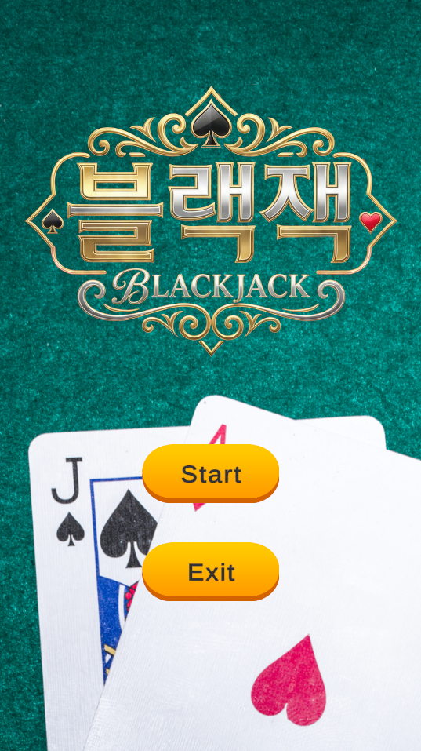
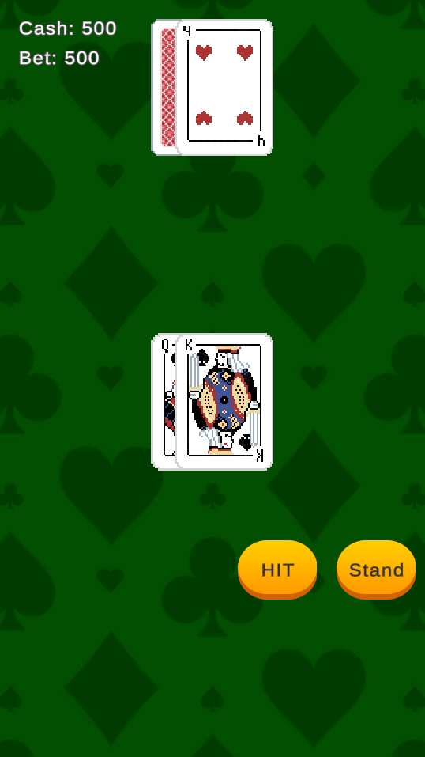

# Blackjack
유니티 게임 개발 역량 강화를 위한 미니 프로젝트 '블랙잭'입니다.

## 개발 환경
* Unity 6.3 (6000.3.1f1) 
* Visual Studio 2022
* Github Desktop
* Gemini 3 Pro
* Nanobanana Pro
## 사용 리소스
### Itch.io
* [art_bickles - Pixel Art Card Deck – 52 Cards + Joker + 3 Backs](https://art-bickles.itch.io/playing-cards)
* [reflector88 - Casino (RMMZ Plugin)](https://reflector88.itch.io/casino)
### Designed by Freepik
* [Freepik - Flat design poker table background](https://kr.freepik.com/free-vector/flat-design-poker-table-background_94956216.htm#fromView=keyword&page=1&position=4&uuid=58d19bf7-aefa-4d0a-80ac-01c98beab463&query=Poker+table)
* [Freepik - Flat design bankruptcy concept](https://kr.freepik.com/free-vector/flat-design-bankruptcy-concept_7473192.htm#from_element=cross_selling__vector)
* [Freepik - Jack spade heart ace playing card with whiskey glass poker table](https://kr.freepik.com/free-photo/jack-spade-heart-ace-playing-card-with-whiskey-glass-poker-table_2914538.htm#fromView=search&page=1&position=3&uuid=1e9fe08d-f24f-4b5b-84be-f320ce2870ec&query=blackjack)
### Standard Unity Asset Store EULA
* [Demigiant - DOTween (HOTween v2)](https://assetstore.unity.com/packages/tools/animation/dotween-hotween-v2-27676)
* [That Witch Design - Simple Button Set 01](https://assetstore.unity.com/packages/2d/gui/icons/simple-button-set-01-153979)
### TTS Maker Team(https://ttsmaker.com/)
## 개발 주요 포인트
### AI 사용
* Gemini 3.0 Pro를 사용하여 기능 구현, 애니메이션 구현 시간 단축
* Nanobanana Pro를 사용하여 로고 이미지 생성
* 리팩토링, 버그 수정은 직접 시행
### SOLID 원칙 준수
* 게임 상태 구분에 State 패턴 사용, ISP 준수
* 최대한 SRP를 준수하도록 코드 작성(예시: Hand.cs에서 애니메이션 처리 X, AnimationManager.cs로 분리)
* Hand 클래스의 자식 클래스인 Dealer, Player 클래스를 LSP 준수하도록 작성
### 라이센스 및 출처 표기
* 크레딧 화면이 없으니 Readme.md에 제작자 요청을 준수하여 작성 
## 스크린샷

